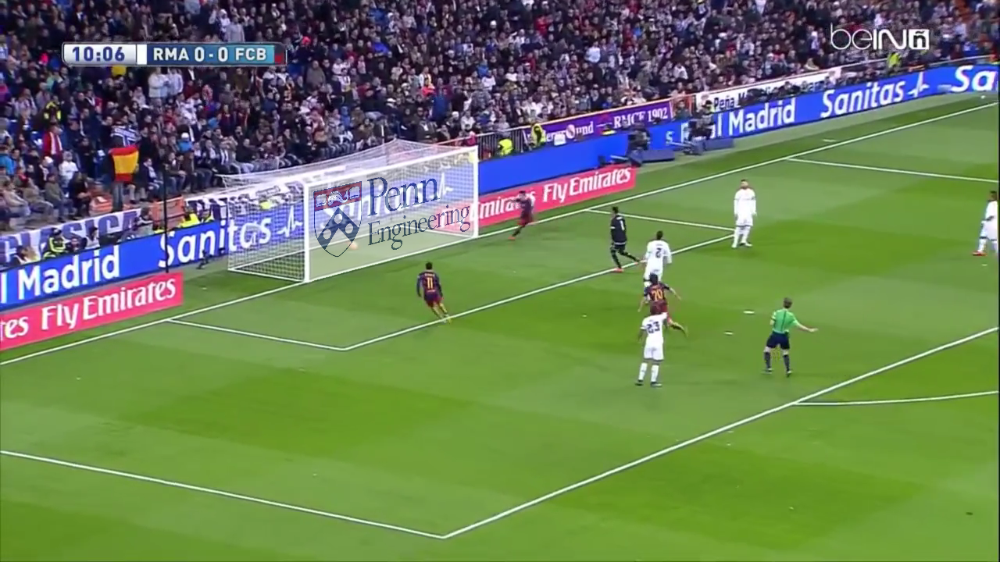
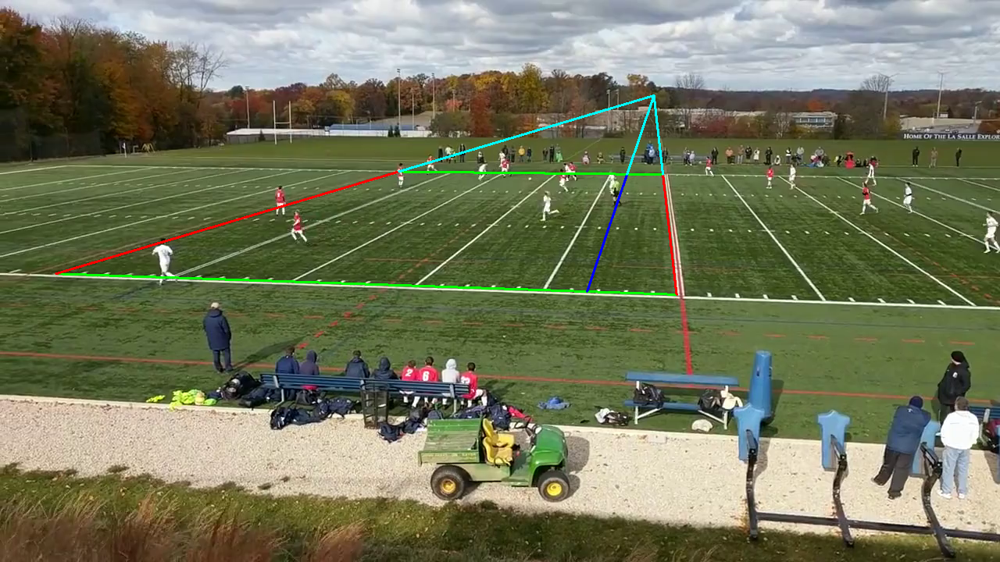
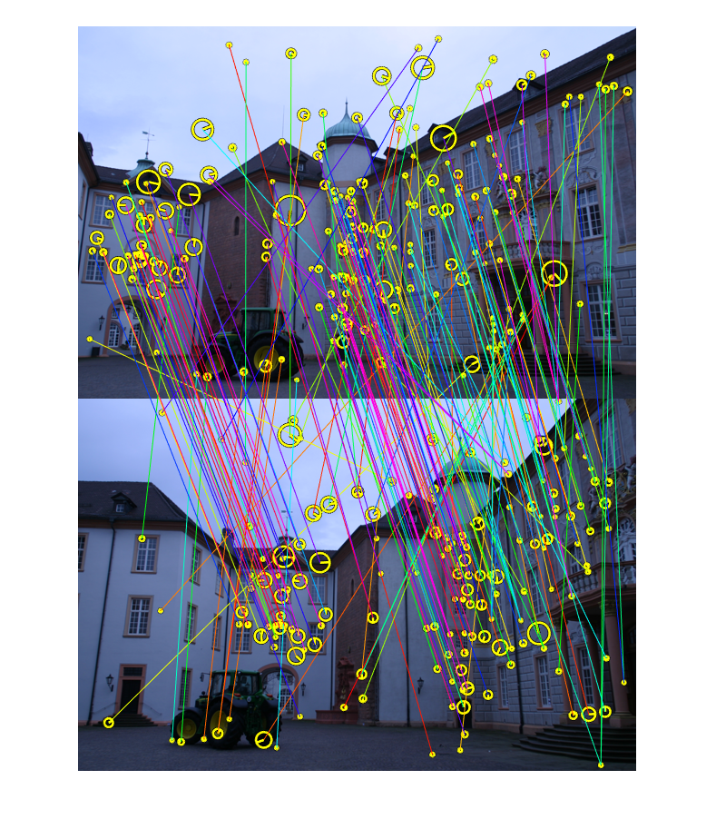
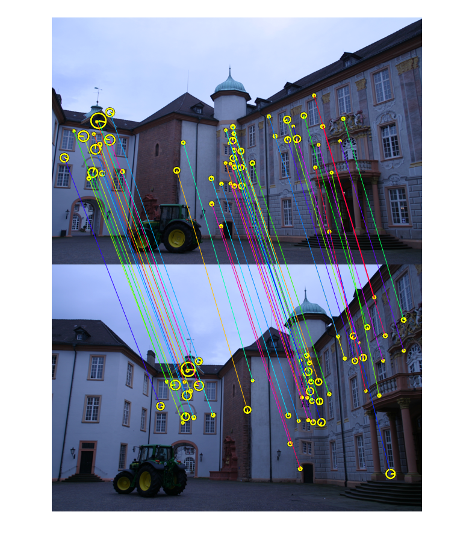
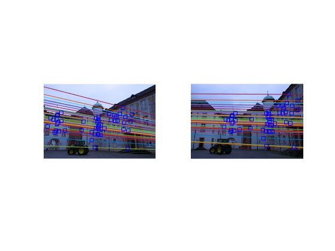
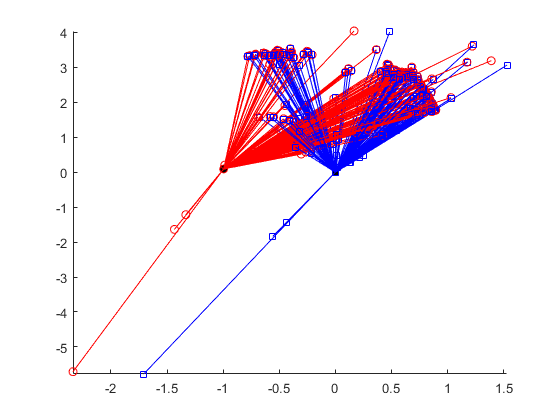
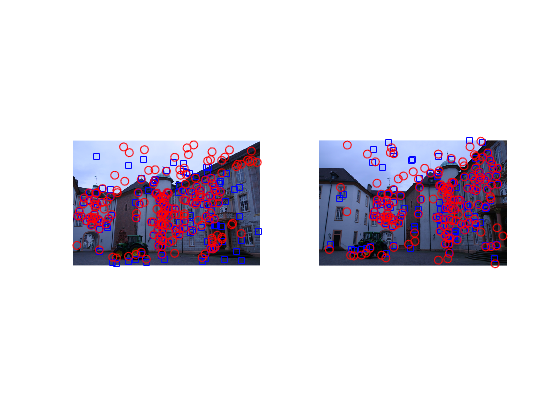
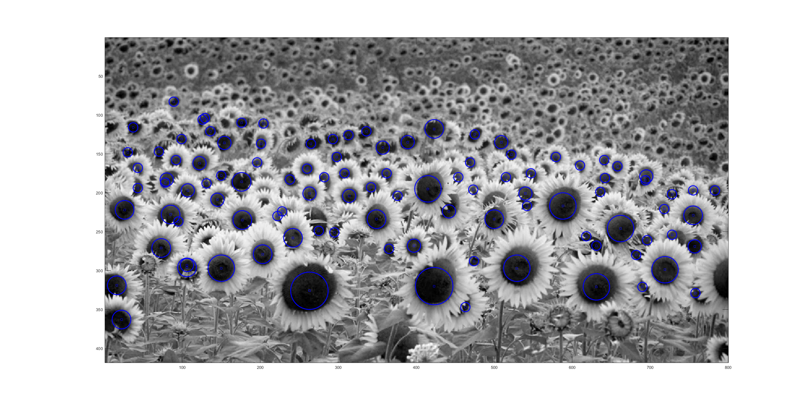
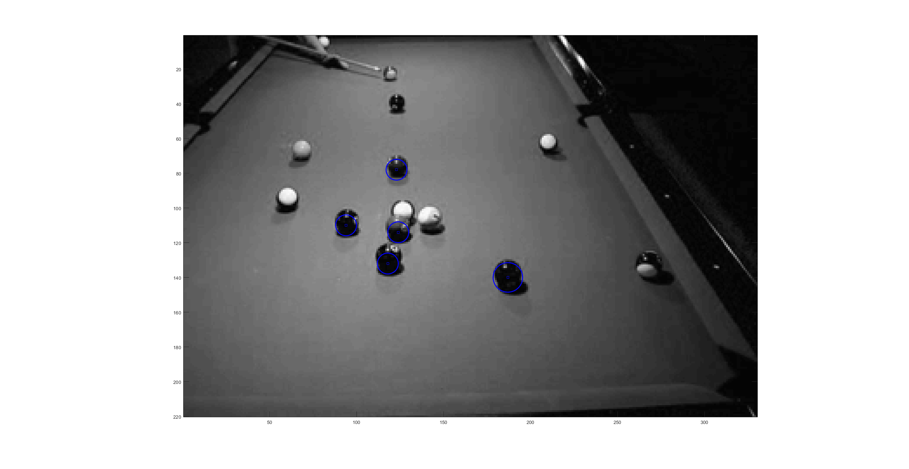

# machine-perception

## project 1

Utilizing projective geometry and homographies to project an image onto a scene.
.center[
.caption[Projection of Penn Engineering Logo onto goal post of a video.]]

.center[Drawing of referre line onto field of video field.]

## project 2

3D reconstruction from two 2D images utilizing SIFT matches with epipolar constraints and RANSAC to recover the pose between the two images.

.center[SIFT correspondances.]

.center[RANSAC inliers.]

.center[Epipolar lines.]

.center[Reconstruction of scene.]

.center[Reprojection of images in one scene into the other.]

## project 3

Scale invariant blob detection utilizing a difference of a Gaussian (DoG) filter over a scale space and determining which scale maximizes the filter.

.center[Sunflower detection.]

.center[Billard balls detection.]