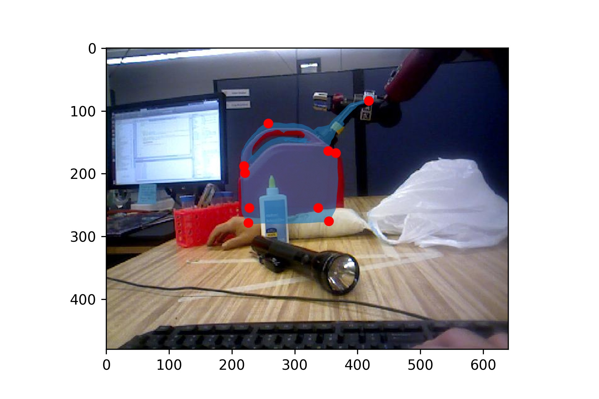

# machine-perception

## project 1

Utilizing projective geometry and homographies to project an image onto a scene.

Projection of Penn Engineering Logo onto goal post of a video.

Drawing of referee line onto field of video field.

## project 2

3D reconstruction from two 2D images utilizing SIFT matches with epipolar constraints and RANSAC to recover the pose between the two images.

SIFT correspondances.

RANSAC inliers.

Epipolar lines.

Reconstruction of scene.

Reprojection of images in one scene into the other.

## project 3

Scale invariant blob detection utilizing a difference of a Gaussian (DoG) filter over a scale space and determining which scale maximizes the filter.

Sunflower detection.

Billard balls detection.

## project 4

Trained a network that predicts the location of keypoints given an image of an object. 

Utilize the predicted keypoints to estimate the 6DoF pose of an object by aligning a CAD model to the detected keypoints.

